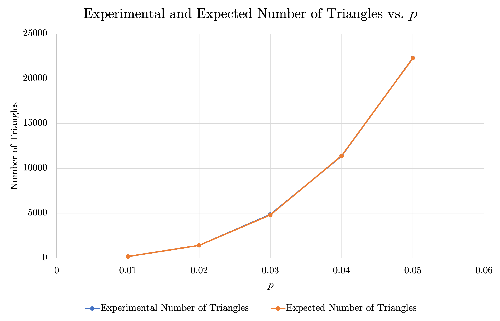

# CS 124: Strassen's Algorithm 
## Albert Qi and Steve Dalla
### March 29, 2023

## Table of Contents
1. Introduction
2. Analytical Cross-Over Point
3. Experimental Cross-Over Point
4. Triangles in Random Graphs
5. Discussion of Experiments

## 1. Introduction

## 2. Analytical Cross-Over Point

There are $n^2$ entries, and for each entry, there are $n$ multiplications and $n-1$ additions.

$$\begin{aligned}
T_C(n)&=n^2(n+(n-1))\\
&=n^2(2n-1)
\end{aligned}$$

There are $7$ subproblems of size $n/2$, and there are $18$ additions and subtractions on $n/2\times n/2$ matrices.

$$\begin{aligned}
T_S(n)&=7\cdot T_S\left(\frac{n}{2}\right)+18\left(\frac{n}{2}\right)^2\\
&=7\cdot T_S\left(\frac{n}{2}\right)+\frac{9n^2}{2}
\end{aligned}$$

For even $n$, we know that:

$$\begin{gathered}
T_C(n)=7\cdot T_C\left(\frac{n}{2}\right)+\frac{9n^2}{2}\\
n^2(2n-1)=7\left(\frac{n}{2}\right)^2\left(2\left(\frac{n}{2}\right)-1\right)+\frac{9n^2}{2}\\
n^2(2n-1)=\frac{7n^2(n-1)}{4}+\frac{9n^2}{2}\\
4n^2(2n-1)=7n^2(n-1)+18n^2\\
n^3-15n^2=0\\
n=0,15
\end{gathered}$$

Thus, for even dimensions, we have that $n_0=15$.

## 3. Experimental Cross-Over Point

## 4. Triangles in Random Graphs

For each probability $p$, we create $10$ random graphs and calculate the average number of triangles. The following table compares these averages to the expected number of triangles, which is $\binom{1024}{3}p^3$.

| $p$    | Experimental Number of Triangles | Expected Number of Triangles |
| :-----:| :------------------------------: | :--------------------------: |
| $0.01$ | $175.8$                          | $178.4$                      |
| $0.02$ | $1419.8$                         | $1427.5$                     |
| $0.03$ | $4867.4$                         | $4817.7$                     |
| $0.04$ | $11395.3$                        | $11419.7$                    |
| $0.05$ | $22323.9$                        | $22304.1$                    |

We can then graph these results to better visualize how the experimental number of triangles compares to the expected number of triangles.

As we can see by the graph, the experimental number of triangles aligns very closely with the expected number of triangles. Indeed, the experimental number only differs from the expected number of triangles by at most $1.46$ percent (with $p=0.01$).

## 5. Discussion of Experiments

