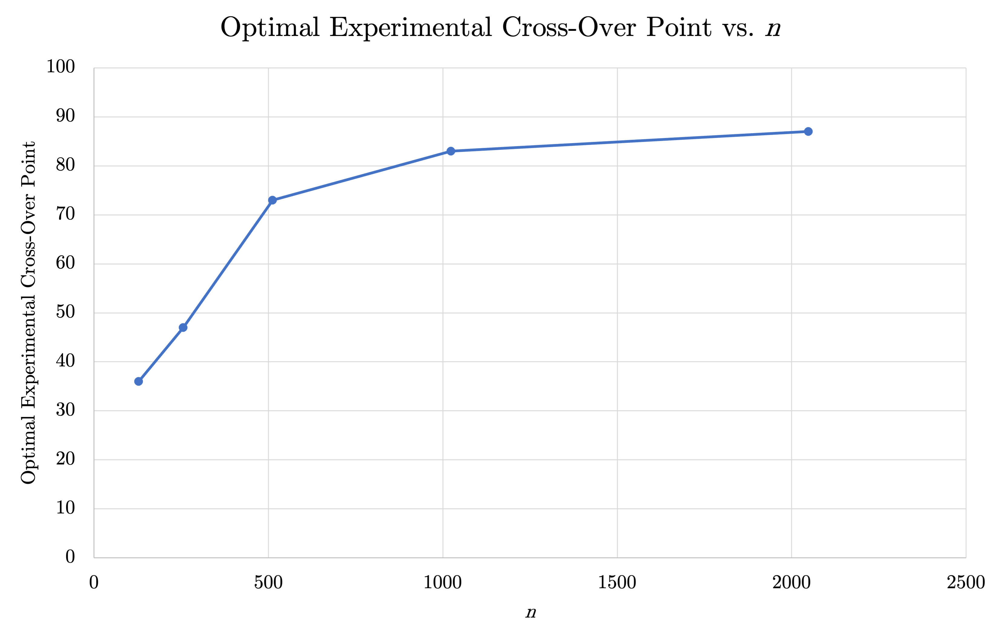

# CS 124: Strassen's Algorithm 
## Albert Qi and Steve Dalla
### March 29, 2023

## Table of Contents
1. Introduction
2. Analytical Cross-Over Point
3. Experimental Cross-Over Point
4. Triangles in Random Graphs
5. Discussion of Experiments

## 1. Introduction

In this write-up, we will determine the optimal cross-over point from Strassen multiplication to conventional multiplication. We will first find the analytical cross-over point and then compare that to our experimental cross-over point. Using this, we can also estimate the number of triangles in a random graph for various probabilities of including an edge. Finally, we will discuss our experiments in more depth, covering the optimizations of our algorithm and other intriguing details we discovered along the way.

## 2. Analytical Cross-Over Point

Before experimentally finding the cross-over point, it is helpful to first determine the cross-over point analytically. That is, we can mathematically calculate the value of $n_0$ that optimizes the runtime of Strassen's algorithm. We will begin by calculating the runtimes for both the conventional matrix multiplication algorithm and Strassen's multiplication algorithm.

Let $T_C(n)$ be the runtime of the conventional algorithm on an $n\times n$ matrix. When performing conventional multiplication on an $n\times n$ matrix, we need to update $n^2$ entries. Then, for each entry, there are $n$ multiplications and $n-1$ additions, meaning:

$$\begin{aligned}
T_C(n)&=n^2(n+(n-1))\\
&=n^2(2n-1)
\end{aligned}$$

Now, let $T_S(n)$ be the runtime of Strassen's algorithm on an $n\times n$ matrix. When performing Strassen multiplication on an $n\times n$ matrix, we need to solve $7$ subproblems, each of size $n/2$. Additionally, there are $18$ total additions and subtractions, each on $n/2\times n/2$ matrices. This means that:

$$\begin{aligned}
T_S(n)&=7\cdot T_S\left(\frac{n}{2}\right)+18\left(\frac{n}{2}\right)^2\\
&=7\cdot T_S\left(\frac{n}{2}\right)+\frac{9n^2}{2}
\end{aligned}$$

To then find the optimal cross-over point, we want to calculate the value of $n$ such that the time to perform conventional multiplication equals the time to perform Strassen multiplication with all subproblems using the conventional multiplication algorithm. For even values of $n$, we have that:

$$\begin{gathered}
T_C(n)=7\cdot T_C\left(\frac{n}{2}\right)+\frac{9n^2}{2}\\
n^2(2n-1)=7\left(\frac{n}{2}\right)^2\left(2\left(\frac{n}{2}\right)-1\right)+\frac{9n^2}{2}\\
n^2(2n-1)=\frac{7n^2(n-1)}{4}+\frac{9n^2}{2}\\
4n^2(2n-1)=7n^2(n-1)+18n^2\\
n^3-15n^2=0\\
n=0,15
\end{gathered}$$

We do not care about the degenerate case where $n=0$, so for even dimensions, we get that $n_0=15$.

For odd values of $n$, we first pad the matrix to be $(n+1)\times(n+1)$ in size. As such, we know that:

$$\begin{gathered}
T_C(n)=7\cdot T_C\left(\frac{n+1}{2}\right)+\frac{9(n+1)^2}{2}\\
n^2(2n-1)=7\left(\frac{n+1}{2}\right)^2\left(2\left(\frac{n+1}{2}\right)-1\right)+\frac{9(n+1)^2}{2}\\
n^2(2n-1)=\frac{7n(n+1)^2}{4}+\frac{9(n+1)^2}{2}\\
4n^2(2n-1)=7n(n+1)^2+18(n+1)^2\\
n^3-36n^2-43n-18=0\\
n\approx 37.170
\end{gathered}$$

Thus, for odd dimensions, we get that $n_0=37$.

## 3. Experimental Cross-Over Point

For each $n=128,256,512,1024,2048$, we determine the optimal experimental cross-over point $n_0$ by finding the value of $n_0$ from $10$ to $n$ that minimizes the average runtime of Strassen multiplication on two random $-1/0/1$ matrices of size $n\times n$; we can safely start at $n_0=10$ because it is smaller than the optimal analytical cross-over point. The following table shows the optimal experimental cross-over point for various values of $n$ with runtimes averaged across $10$ trials. 

| $n$    | Optimal Cross-Over Point |
| :-----:| :----------------------: |
| $128$  | $36$                     |
| $256$  | $47$                     |
| $512$  | $73$                     |
| $1024$ | $83$                     |
| $2048$ | $87$                     |

Note that we do not include the results for extremely small values of $n$, such as $16$ or $32$. These dimensions are so small that the optimal cross-over point is simply the highest value possible (i.e., the optimal cross-over point equals $n$). This only tells us that the optimal cross-over point is at least $n$, which is not very useful. For example, the true optimal cross-over point could be $32$ or $124$, and in both cases, the outputted optimal cross-over point for $n=16$ and $n=32$ would just be $16$ and $32$, respectively.

Now, averaging our experimental cross-over points, we get an optimal cross-over point of $n_0\approx 65$. This cross-over point is significantly higher than the analytical cross-over point (i.e., the higher analytical cross-over point of $37$), which is likely due to two main reasons:

1. Our analytical cross-over point does not account for memory allocation during Strassen's algorithm. During Strassen multiplication, we need to create new matrices, whereupon we may need to use the `new` keyword. Dynamically allocating memory takes a nontrivial amount of time, meaning Strassen's algorithm will take longer than we expect. This increases the experimental cross-over point.

2. Our calculation of the analytical cross-over point assumes that all arithmetic operations take $O(1)$ time. In practice, the runtime of arithmetic operations depends on the size of the inputs. Multiplying two large numbers, for instance, will not take a constant amount of time. This ultimately increases the runtime of Strassen's algorithm, thereby also increasing the experimental cross-over point.

We can now graph the results to better visualize how the optimal experimental cross-over point changes with $n$.

The experimental cross-over point seems to increase as $n$ increases; this makes sense. As $n$ increases, we need more and more memory allocations and arithmetic operations for Strassen's algorithm. Meanwhile, the number of operations for the conventional algorithm does not increase as much. Thus, the experimental cross-over point continually increases as $n$ goes from $128$ to $2048$.

This then raises an interesting issue regarding the practicality of a cross-over point. A cross-over point is certainly necessary for Strassen's algorithm to run reasonably fast; running Strassen's algorithm all the way down to $1\times 1$ matrices is absurd. However, because the experimental cross-over point differs based on $n$, it may be hard to define as a constant. This means that, in practice, the optimal cross-over point might be better represented as a function of $n$.

Lastly, we also ran experiments on $0/1/2$ matrices but saw no difference in runtimes or cross-over points. All operations for $0/1/2$ matrices seem to take about the same amount of time as they do for $-1/0/1$ matrices.

## 4. Triangles in Random Graphs

For each probability $p=0.01,0.02,0.03,0.04,0.05$, we create $10$ random graphs and calculate the average number of triangles. The following table compares these averages to the expected number of triangles, which is $\binom{1024}{3}p^3$.

| $p$    | Experimental Number of Triangles | Expected Number of Triangles |
| :-----:| :------------------------------: | :--------------------------: |
| $0.01$ | $175.8$                          | $178.4$                      |
| $0.02$ | $1419.8$                         | $1427.5$                     |
| $0.03$ | $4867.4$                         | $4817.7$                     |
| $0.04$ | $11395.3$                        | $11419.7$                    |
| $0.05$ | $22323.9$                        | $22304.1$                    |

We can then graph these results to better visualize how the experimental number of triangles compares to the expected number of triangles.

As we can see by the graph, the experimental number of triangles aligns very closely with the expected number of triangles. Indeed, the experimental number only differs from the expected number of triangles by at most $1.46$ percent (where $p=0.01$).

## 5. Discussion of Experiments

In order to reduce the runtimes of both the conventional matrix multiplication algorithm and Strassen's multiplication algorithm, we make several design choices that each optimize the algorithms in different ways.

Let us first discuss the `Matrix` object. We decide to represent the elements of each matrix fundamentally as a single array (hereinafter referred to as "matrix array") as opposed to an array of arrays since keeping track of one pointer is much simpler. This means that we can access the element at row `i` and column `j` via `arr[i * dim + j]` instead of `arr[i][j]`. Note that we use arrays instead of vectors since they use less memory and we never need to change the size of the arrays that we create.

Now, to improve the conventional algorithm, we traverse the matrix arrays in sequential order whenever possible by utilizing a loop order of `ikj` instead of `ijk`. We know that sequential access is faster than random access, so traversing matrix arrays in sequential order ultimately helps improve the runtime of the conventional algorithm.

For Strassen's algorithm, we are able to improve the runtime through a few optimizations. First, the design of the `Matrix` object allows us to have every `Matrix` object maintain a pointer to its matrix array. Because the pointer itself does not take up much space, we can easily have many `Matrix` objects access the same array in memory. This allows us to partition a matrix into quarters without requiring us to duplicate the entire matrix array, which would drastically worsen both the time and space complexity. Instead, we can just create four `Matrix` objects that share the same pointer but have different row and column starting positions.

Now, how do we handle Strassen multiplication on matrices with odd dimensions? Instead of padding the multiplicands to be of size $2^k\times 2^k$, we choose to just pad one extra row and column of zeros. We utilize this padding method since padding the multiplicands to be the next greater power of $2$ in size requires a lot of time and memory.

To further reduce the runtime as well, we do not literally update the matrix array in memory to include an extra row and column of zeros. Instead, this is handled by the function call operator `()`. We set this operator to normally return a reference to an element at a certain row and column in a matrix, but if the row or column is invalid, then the function call operator will return a reference to `zero` instead. This allows us to simulate a padded matrix without having to literally add a row and column of zeros.

As a final minor optimization, we also pass objects by reference whenever possible. This reduces the number of unnecessary copies and improves the runtimes for both the conventional and Strassen multiplication algorithms.

Lastly, note that we generate random values through the `<random>` header because we trust this more than the C standard library function `rand`. Our generator is also `thread_local` and seeded via `random_device`, ensuring that each trial has independent randomness.